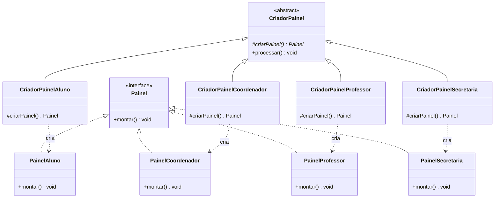

```mermaid
classDiagram
    %% Interface (Produto)
    class Painel {
        <<interface>>
        +montar() void
    }

    %% Produtos Concretos
    class PainelAluno {
        +montar() void
    }
    class PainelCoordenador {
        +montar() void
    }
    class PainelProfessor {
        +montar() void
    }
    class PainelSecretaria {
        +montar() void
    }

    Painel <|.. PainelAluno
    Painel <|.. PainelCoordenador
    Painel <|.. PainelProfessor
    Painel <|.. PainelSecretaria

    %% Criador Abstrato
    class CriadorPainel {
        <<abstract>>
        #criarPainel() Painel*
        +processar() void
    }

    %% Criadores Concretos
    class CriadorPainelAluno {
        #criarPainel() Painel
    }
    class CriadorPainelCoordenador {
        #criarPainel() Painel
    }
    class CriadorPainelProfessor {
        #criarPainel() Painel
    }
    class CriadorPainelSecretaria {
        #criarPainel() Painel
    }

    CriadorPainel <|-- CriadorPainelAluno
    CriadorPainel <|-- CriadorPainelCoordenador
    CriadorPainel <|-- CriadorPainelProfessor
    CriadorPainel <|-- CriadorPainelSecretaria

    %% Relações de Dependência (Instanciação)
    CriadorPainelAluno ..> PainelAluno : cria
    CriadorPainelCoordenador ..> PainelCoordenador : cria
    CriadorPainelProfessor ..> PainelProfessor : cria
    CriadorPainelSecretaria ..> PainelSecretaria : cria
```
